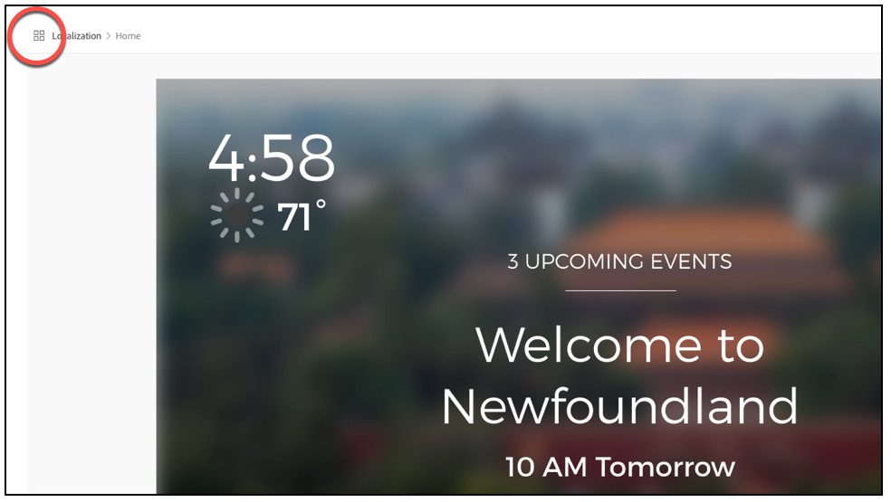

## Adobe XD

#### D1. Dov'era questo `Lock` icona applicata?

- [ ] nella sezione `Components` pannello
- [x] nella casella `Layers` pannello
- [ ] nella sezione `Property Inspector`
- [ ] in modalità Condividi

#### D2. In questa figura, quale valore rappresenta il margine inferiore della griglia di layout?

- [ ] 30
- [x] 20
- [ ] 43
- [ ] 0

#### D3. Cosa ti consente di fare clic sull'icona cerchiata?

- [ ] Modificare il trigger.
- [ ] Scegli una destinazione.
- [ ] Aggiungi una nuova interazione.
- [x] Aggiungere un nuovo stato.

#### D4. Vuoi condividere il tuo progetto su un blog o sui social media. Come ci riusciresti?

- [x] Collegamento al progetto dall'account Creative Cloud.
- [ ] Utilizzare il collegamento prototipo.
- [ ] Aggiungi il link del prototipo a un blog.
- [ ] Aggiungi i tuoi account di social media alla tua lista di inviti.

#### D5. È necessario che venga visualizzata una tastiera quando si tocca un'area di testo. Quale tipo di azione applicare?

- [ ] Animazione automatica
- [ ] Sovrapposizione
- [ ] Tavola da disegno precedente.
- [ ] Transizione.

#### D6. Come si impedisce alle guide di agganciarsi agli oggetti sulla tavola da disegno?

- [ ] Premere Opzione (Mac) o Alt (Windows) quando si trascina la guida.
- [х] Premere Comando (Mac) o Ctrl (Windows) quando si trascina la guida.
- [ ] Premere maiusc quando si trascina la guida.
- [ ] Trascinare la guida nella sua posizione sulla tavola da disegno.

#### D7. Lo sviluppatore ti avvisa che l'allineamento a sinistra di parte del testo in una diapositiva nel menu è disattivato di 2 pixel. Come ha fatto lo sviluppatore a catturarlo?

- [ ] I valori della distanza vengono visualizzati nella schermata di condivisione dello sviluppatore.
- [ ] Lo sviluppatore li ha spostati nella schermata di condivisione dello sviluppatore.
- [ ] I diversi valori sono stati annotati nel CSS.
- [ ] Le guide della tavola da disegno vengono visualizzate nella schermata di condivisione dello sviluppatore.

#### D8. Come si può scambiare un componente con un altro che è già nel progetto?

- [ ] Copiate il componente nel pannello Risorse, selezionate il componente nel progetto e incollatelo.
- [ ] Eliminate il componente nel progetto e trascinate il nuovo componente dal pannello Risorse
- [ ] Fare clic con il pulsante destro del mouse sul componente che si desidera sostituire e selezionare Modifica master nel documento di origine.
- [ ] Trascinate il nuovo componente dal pannello Risorse sopra il componente esistente nel progetto.

#### D9. È stato creato un pulsante e convertito in un componente per renderlo interattivo. Quando si apre l'area Componente (Master) in Impostazioni proprietà e si fa clic su Stato predefinito, si nota che al pulsante è già applicato uno stato. Quale stato viene applicato?

- [x] Passa il mouse
- [ ] Trascina
- [ ] Voce
- [ ] Tocca

#### D10. È stata copiata un'interazione negli Appunti. Come applicheresti questa interazione a più oggetti?

- [ ] Tenete premuto Maiusc e fate clic su ciascun oggetto e incollate l'interazione.
- [ ] Selezionare le tavole da disegno e incollare l'interazione.
- [ ] Selezionare ogni oggetto e incollare l'interazione.
- [ ] Marquee gli oggetti e incollare l'interazione.

#### D11. L'anteprima del dispositivo richiede un \_

- [ ] dispositivo mobile con NFC
- [ ] connessione bluetooth
- [ ] Connessione USB
- [ ] connessione wireless

#### D12. Quale impostazione di esportazione utilizzeresti per creare una risorsa a bassa risoluzione la cui dimensione è il 50% della risorsa sullo schermo?

- [ ] Progettato su 3X
- [ ] Progettato per il Web
- [ ] Progettato a 1X
- [ ] Progettato in 2X

#### D13. Cosa indica questo filo attaccato a un componente?

- [ ] destinazione.
- [x] interazione.
- [ ] trigger
- [ ] animazione.

#### D14. Cosa succede quando si fa clic su questa icona cerchiata nell'anteprima del progetto?

- [x] L'anteprima passa alla vista tavola da disegno.
- [ ] L'anteprima passa al flusso utente.
- [ ] L'anteprima passa alla visualizzazione sviluppatore.
- [ ] Vengono visualizzate le proprietà della tavola da disegno

#### D15. Quale metodo per portare i contenuti di Illustrator in XD non è possibile?

- [ ] Trascinate un file di Illustrator (. Al) in un progetto XD.
- [x] Copia e incolla il contenuto da Illustrator a XD.
- [ ] Aprite un file illustrator (. Al) in XD per convertirlo in un progetto XD.
- [ ] Importare un file illustrator (. Al) in un progetto XD.

#### D16. Dopo aver completato un progetto, avete disattivato un paio di font Adobe. Ora è necessario apportare modifiche al file XD. Come si riattivano i font Adobe in XD?

- [ ] Apri i font Creative Cloud e fai clic su Abilita.
- [ ] Abilita i font nelle impostazioni dei font del tuo computer.
- [ ] I font Adobe vengono riattivati automaticamente tramite Creative Cloud.
- [ ] Ricollega i font alla libreria Creative Cloud.
